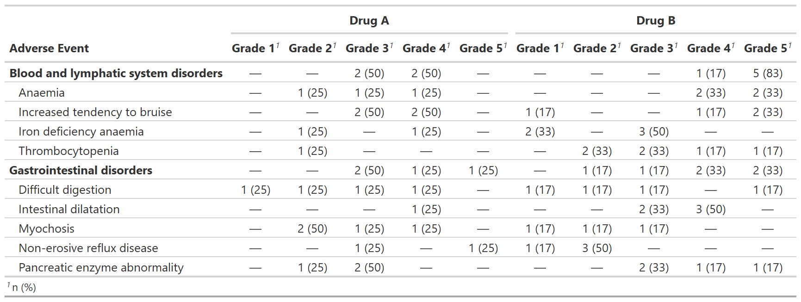

<!-- README.md is generated from README.Rmd. Please edit that file -->

```{r, include = FALSE}
knitr::opts_chunk$set(
  collapse = TRUE,
  comment = "#>",
  fig.path = "man/figures/README-",
  out.width = "100%"
)
```

# gtreg

<!-- badges: start -->
[](https://lifecycle.r-lib.org/articles/stages.html#experimental)
[](https://CRAN.R-project.org/package=gtreg)
[](https://app.codecov.io/gh/shannonpileggi/gtreg?branch=main)
[](https://github.com/shannonpileggi/gtreg/actions)
<!-- badges: end -->

The goal of gtreg is to ...

## Installation

You can install the development version of gtreg from [GitHub](https://github.com/) with:

``` r
# install.packages("devtools")
devtools::install_github("shannonpileggi/gtreg")
```

## Example

This is a basic example which shows you how to solve a common problem:

```{r example}
library(gtreg)

tbl <- 
  df_adverse_events %>%
  tbl_adverse_events(
    id = patient_id,
    adverse_event = adverse_event,
    soc = system_organ_class, 
    grade = grade, 
    strata = trt
  )
```

```{r example-tbl_adverse_events, include = FALSE}
# Had to manually save images in temp file, not sure if better way.
gt::gtsave(as_gt(tbl), file = file.path(tempdir(), "temp.png"))
```

```{r out.width = "100%", echo = FALSE}
# Have to do this workaround since the README needs markdown format for GitHub page but a different format for the website.
if (identical(Sys.getenv("IN_PKGDOWN"), "true")) {
  tbl
} else {
  
} 
```

In that case, don't forget to commit and push the resulting figure files, so they display on GitHub and CRAN.

## Code of Conduct

Please note that the gtreg project is released with a [Contributor Code of Conduct](https://contributor-covenant.org/version/2/0/CODE_OF_CONDUCT.html). By contributing to this project, you agree to abide by its terms.

