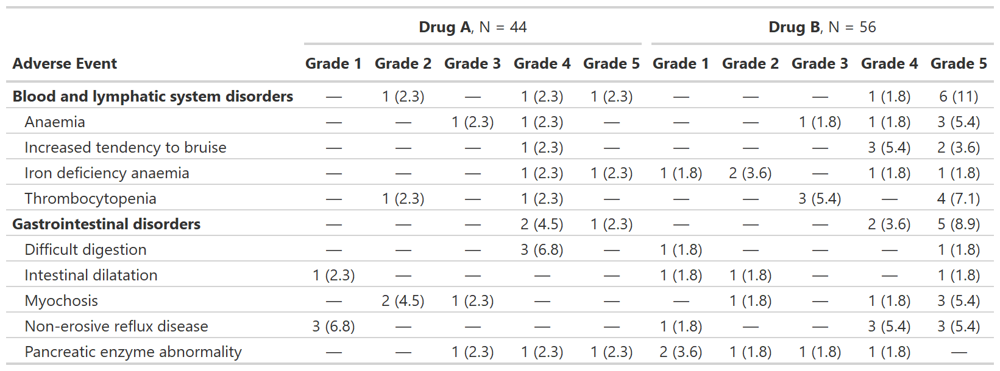
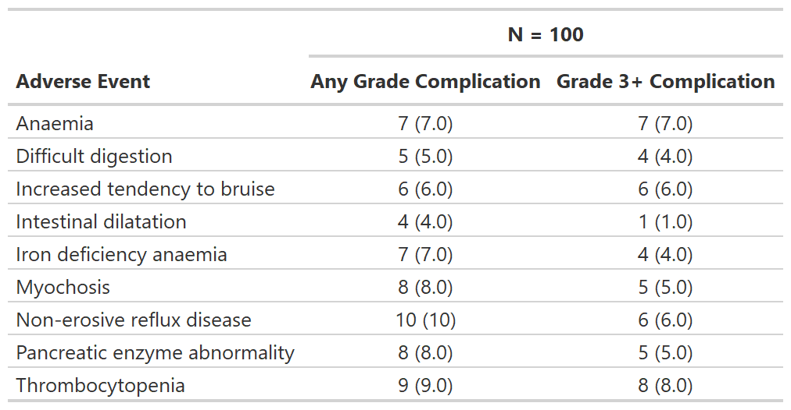
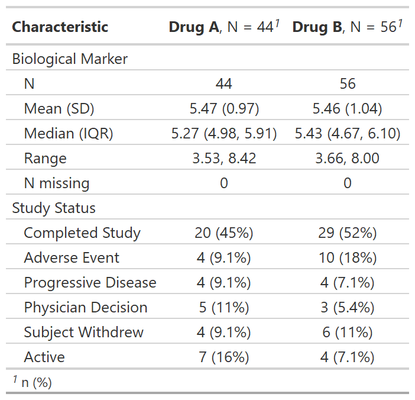

<!-- README.md is generated from README.Rmd. Please edit that file -->

```{r, include = FALSE}
knitr::opts_chunk$set(
  collapse = TRUE,
  comment = "#>",
  fig.path = "man/figures/README-",
  out.width = "100%"
)
```

# gtreg <a href="https://shannonpileggi.github.io/gtreg/"></a>


<!-- badges: start -->
[](https://github.com/shannonpileggi/gtreg/actions)
[](https://app.codecov.io/gh/shannonpileggi/gtreg?branch=main)
[](https://CRAN.R-project.org/package=gtreg) [](https://lifecycle.r-lib.org/articles/stages.html#experimental)
<!-- badges: end -->


## Installation

You can install {gtreg} with the following code.

``` r
install.packages("gtreg")
```

You can install the development version of {gtreg} from [GitHub](https://github.com/shannonpileggi/gtreg) with:

``` r
# install.packages("devtools")
devtools::install_github("shannonpileggi/gtreg")
```

## Overview

The {gtreg} package creates tabular data summaries appropriate for regulatory submissions.
The package builds the tables using {gtsummary}.


Here are [slides](https://shannonpileggi.github.io/introducing-gtreg-rmed-2022/#/title-slide) and a [recorded talk (17 min)](https://youtu.be/DmslEfczYqM) from "Introducing {gtreg}: an R package to produce regulatory tables for clinical research" presented at the 2022 R in Medicine conference.

[{width=70%}](https://youtu.be/DmslEfczYqM)

## Functions for adverse event (AE) reporting

**Summarize Raw Adverse Counts**

`tbl_ae_count()` provides counts of all AEs, and omits percentage statistics as multiple AEs 
 can occur per subject.
 

```{r example2}
library(gtreg)
tbl_ae_count <- 
  df_adverse_events |> 
  tbl_ae_count(
    ae = adverse_event,
    soc = system_organ_class, 
    by = drug_attribution
  ) |>
  add_overall(across = "by") |>
  modify_spanning_header(all_ae_cols() ~ "**Drug Attribution**") |>
  bold_labels()
```

```{r example-tbl_ae_count, include = FALSE}
# Had to manually save images in temp file, not sure if better way.
gt::gtsave(as_gt(tbl_ae_count), file = file.path(tempdir(), "temp2.png"))
```

```{r out.width = "76%", echo = FALSE}
# Have to do this workaround since the README needs markdown format for GitHub page but a different format for the website.
if (identical(Sys.getenv("IN_PKGDOWN"), "true")) {
  as_gt(tbl)
} else {
  knitr::include_graphics("man/figures/README-example-tbl_ae_count-1.png")
} 
```
 
**Summarize Adverse Events by Grade**

`tbl_ae()` counts one AE per subject by maximum grade; percentage statistics are provided by default with 
the denominators reflecting the number of patients in the study.

```{r example}
library(gtreg)
gtsummary::theme_gtsummary_compact()

tbl_ae <- 
  df_adverse_events |>
  tbl_ae(
    id_df = df_patient_characteristics,
    id = patient_id,
    ae = adverse_event,
    soc = system_organ_class, 
    by = grade, 
    strata = trt
  ) |>
  modify_header(all_ae_cols() ~ "**Grade {by}**") |> 
  bold_labels()
```

```{r example-tbl_ae, include = FALSE}
# Had to manually save images in temp file, not sure if better way.
gt::gtsave(as_gt(tbl_ae), file = file.path(tempdir(), "temp.png"))
```

```{r out.width = "100%", echo = FALSE}
# Have to do this workaround since the README needs markdown format for GitHub page but a different format for the website.
if (identical(Sys.getenv("IN_PKGDOWN"), "true")) {
  as_gt(tbl)
} else {
  
} 
```
 
 
**Focus on rates of high grade complications**
 
`tbl_ae_focus()` also counts one AE per subject by maximum grade, and is a convenience 
to summarize dichotomous AE attributes.
 

```{r example3}
tbl_ae_focus <- 
  df_adverse_events |>
  tbl_ae_focus(
    id_df = df_patient_characteristics,
    id = patient_id,
    ae = adverse_event,
    include = c(any_complication, grade3_complication)
  )
```

```{r example-tbl_ae_focus, include = FALSE}
# Had to manually save images in temp file, not sure if better way.
gt::gtsave(as_gt(tbl_ae_focus), file = file.path(tempdir(), "temp3.png"))
```

```{r out.width = "62%", echo = FALSE}
# Have to do this workaround since the README needs markdown format for GitHub page but a different format for the website.
if (identical(Sys.getenv("IN_PKGDOWN"), "true")) {
  as_gt(tbl)
} else {
  
} 
```

## Other Functions for Clinical Reporting

**Regulatory summary**

`tbl_reg_summary()` creates a data summary table often seen in regulatory submissions.

```{r example4}
tbl_reg_summary <-
  df_patient_characteristics |>
  tbl_reg_summary(by = trt, include = c(marker, status)) 
```

```{r example-tbl_reg_summary, include = FALSE}
# Had to manually save images in temp file, not sure if better way.
gt::gtsave(as_gt(tbl_reg_summary), file = file.path(tempdir(), "temp4.png"))
```


```{r out.width = "42%", echo = FALSE}
# Have to do this workaround since the README needs markdown format for GitHub page but a different format for the website.
if (identical(Sys.getenv("IN_PKGDOWN"), "true")) {
  as_gt(tbl)
} else {
  
} 
```

**Print an AE listing**

`tbl_listing()` creates a gtsummary-class listing of data to enable grouped printing.

```{r example5}
tbl_listing <-
  head(df_adverse_events, n = 10) |>
  select(system_organ_class, adverse_event, grade, drug_attribution, patient_id) |>
  dplyr::arrange(adverse_event, desc(grade)) |>
  tbl_listing(group_by = system_organ_class) |>
  bold_labels()
```

```{r example-tbl_listing, include = FALSE}
# Had to manually save images in temp file, not sure if better way.
gt::gtsave(as_gt(tbl_listing), file = file.path(tempdir(), "temp5.png"))
```


```{r out.width = "62%", echo = FALSE}
# Have to do this workaround since the README needs markdown format for GitHub page but a different format for the website.
if (identical(Sys.getenv("IN_PKGDOWN"), "true")) {
  as_gt(tbl)
} else {
  knitr::include_graphics("man/figures/README-example-tbl_listing-1.png")
} 
```


## Code of Conduct

Please note that the gtreg project is released with a [Contributor Code of Conduct](https://contributor-covenant.org/version/2/0/CODE_OF_CONDUCT.html).
By contributing to this project, you agree to abide by its terms.

