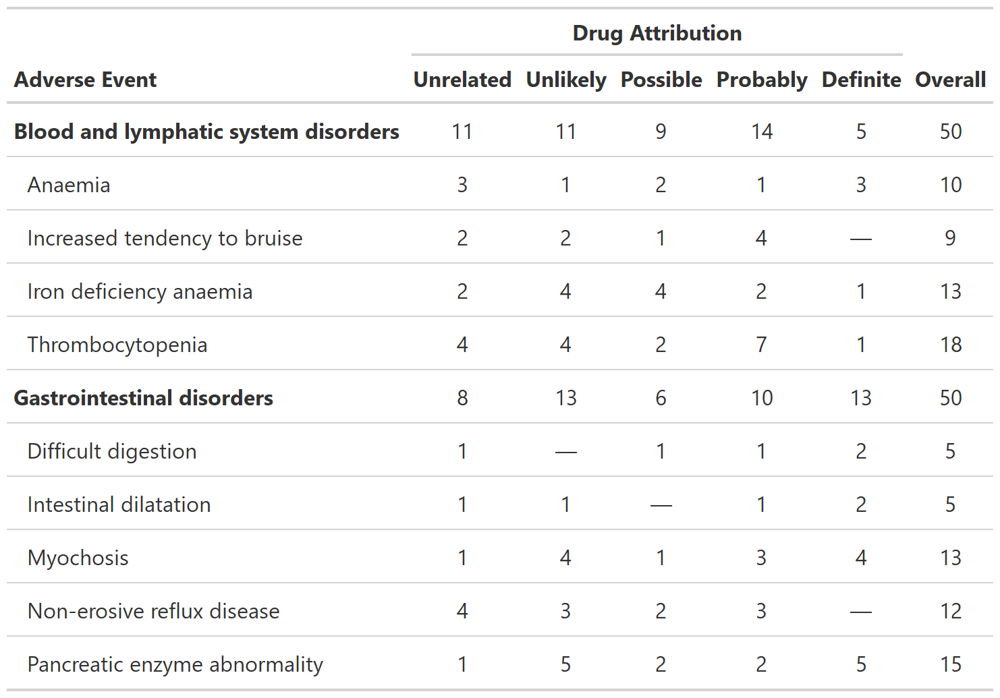

<!-- README.md is generated from README.Rmd. Please edit that file -->

# gtreg

<!-- badges: start -->

[](https://github.com/shannonpileggi/gtreg/actions)
[](https://app.codecov.io/gh/shannonpileggi/gtreg?branch=main)
[](https://CRAN.R-project.org/package=gtreg)
[](https://lifecycle.r-lib.org/articles/stages.html#experimental)
<!-- badges: end -->

The {gtreg} package creates tabular data summaries appropriate for
regulatory submissions. The package builds the tables using {gtsummary}.

## Installation

You can install the development version of {gtreg} from
[GitHub](https://github.com/) with:

``` r
# install.packages("devtools")
devtools::install_github("shannonpileggi/gtreg")
```

## Example

Summarize Adverse Events by Grade. The denominators in the table are the
number of patients in the study.

``` r
library(gtreg)
gtsummary::theme_gtsummary_compact()
#> Setting theme `Compact`

tbl_ae <- 
  df_adverse_events %>%
  tbl_ae(
    id_df = df_patient_characteristics,
    id = patient_id,
    ae = adverse_event,
    soc = system_organ_class, 
    by = grade, 
    strata = trt
  ) %>%
  modify_header(all_ae_cols() ~ "**Grade {by}**") %>% 
  bold_labels()
```


Summarize Raw Adverse Counts

``` r
tbl_ae_count <- 
  df_adverse_events %>%
  tbl_ae_count(
    ae = adverse_event,
    soc = system_organ_class, 
    by = drug_attribution
  ) %>%
  add_overall(across = "by") %>%
  modify_spanning_header(all_ae_cols() ~ "**Drug Attribution**") %>%
  bold_labels()
```



Focus on rates of high grade complications with `tbl_ae_focus()`

``` r
tbl_ae_focus <- 
  df_adverse_events %>%
  tbl_ae_focus(
    id_df = df_patient_characteristics,
    id = patient_id,
    ae = adverse_event,
    include = c(any_complication, grade3_complication)
  )
```


## Code of Conduct

Please note that the gtreg project is released with a [Contributor Code
of
Conduct](https://contributor-covenant.org/version/2/0/CODE_OF_CONDUCT.html).
By contributing to this project, you agree to abide by its terms.
