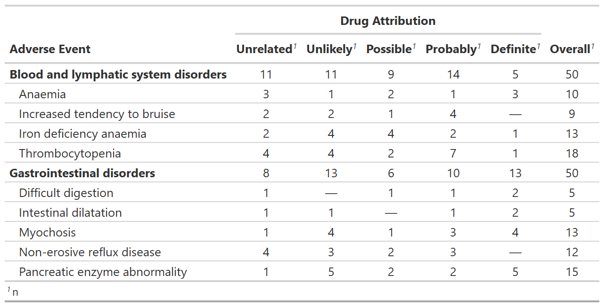
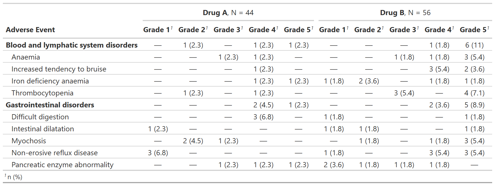
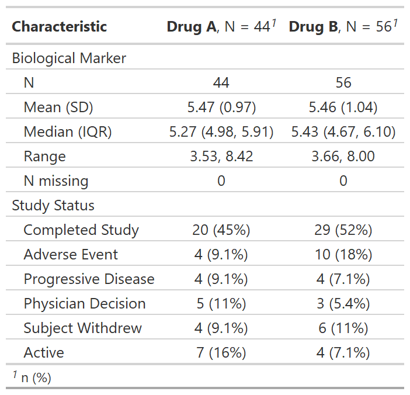

# gtreg

## Installation

You can install {gtreg} with the following code.

``` r
install.packages("gtreg")
```

You can install the development version of {gtreg} from
[GitHub](https://github.com/shannonpileggi/gtreg) with:

``` r
# install.packages("devtools")
devtools::install_github("shannonpileggi/gtreg")
```

## Overview

The {gtreg} package creates tabular data summaries appropriate for
regulatory submissions. The package builds the tables using {gtsummary}.

Here are
[slides](https://shannonpileggi.github.io/introducing-gtreg-rmed-2022/#/title-slide)
and a [recorded talk (17 min)](https://youtu.be/DmslEfczYqM) from
“Introducing {gtreg}: an R package to produce regulatory tables for
clinical research” presented at the 2022 R in Medicine conference.

[](https://youtu.be/DmslEfczYqM)

## Functions for adverse event (AE) reporting

**Summarize Raw Adverse Counts**

[`tbl_ae_count()`](https://shannonpileggi.github.io/gtreg/reference/tbl_ae_count.md)
provides counts of all AEs, and omits percentage statistics as multiple
AEs can occur per subject.

``` r
library(gtreg)
tbl_ae_count <- 
  df_adverse_events |> 
  tbl_ae_count(
    ae = adverse_event,
    soc = system_organ_class, 
    by = drug_attribution
  ) |>
  add_overall(across = "by") |>
  modify_spanning_header(all_ae_cols() ~ "**Drug Attribution**") |>
  bold_labels()
```



**Summarize Adverse Events by Grade**

[`tbl_ae()`](https://shannonpileggi.github.io/gtreg/reference/tbl_ae.md)
counts one AE per subject by maximum grade; percentage statistics are
provided by default with the denominators reflecting the number of
patients in the study.

``` r
library(gtreg)
gtsummary::theme_gtsummary_compact()
#> Setting theme "Compact"

tbl_ae <- 
  df_adverse_events |>
  tbl_ae(
    id_df = df_patient_characteristics,
    id = patient_id,
    ae = adverse_event,
    soc = system_organ_class, 
    by = grade, 
    strata = trt
  ) |>
  modify_header(all_ae_cols() ~ "**Grade {by}**") |> 
  bold_labels()
```



**Focus on rates of high grade complications**

[`tbl_ae_focus()`](https://shannonpileggi.github.io/gtreg/reference/tbl_ae_focus.md)
also counts one AE per subject by maximum grade, and is a convenience to
summarize dichotomous AE attributes.

``` r
tbl_ae_focus <- 
  df_adverse_events |>
  tbl_ae_focus(
    id_df = df_patient_characteristics,
    id = patient_id,
    ae = adverse_event,
    include = c(any_complication, grade3_complication)
  )
```


## Other Functions for Clinical Reporting

**Regulatory summary**

[`tbl_reg_summary()`](https://shannonpileggi.github.io/gtreg/reference/tbl_reg_summary.md)
creates a data summary table often seen in regulatory submissions.

``` r
tbl_reg_summary <-
  df_patient_characteristics |>
  tbl_reg_summary(by = trt, include = c(marker, status)) 
```



**Print an AE listing**

[`tbl_listing()`](https://shannonpileggi.github.io/gtreg/reference/tbl_listing.md)
creates a gtsummary-class listing of data to enable grouped printing.

``` r
tbl_listing <-
  head(df_adverse_events, n = 10) |>
  select(system_organ_class, adverse_event, grade, drug_attribution, patient_id) |>
  dplyr::arrange(adverse_event, desc(grade)) |>
  tbl_listing(group_by = system_organ_class) |>
  bold_labels()
```


## Code of Conduct

Please note that the gtreg project is released with a [Contributor Code
of
Conduct](https://contributor-covenant.org/version/2/0/CODE_OF_CONDUCT.html).
By contributing to this project, you agree to abide by its terms.
