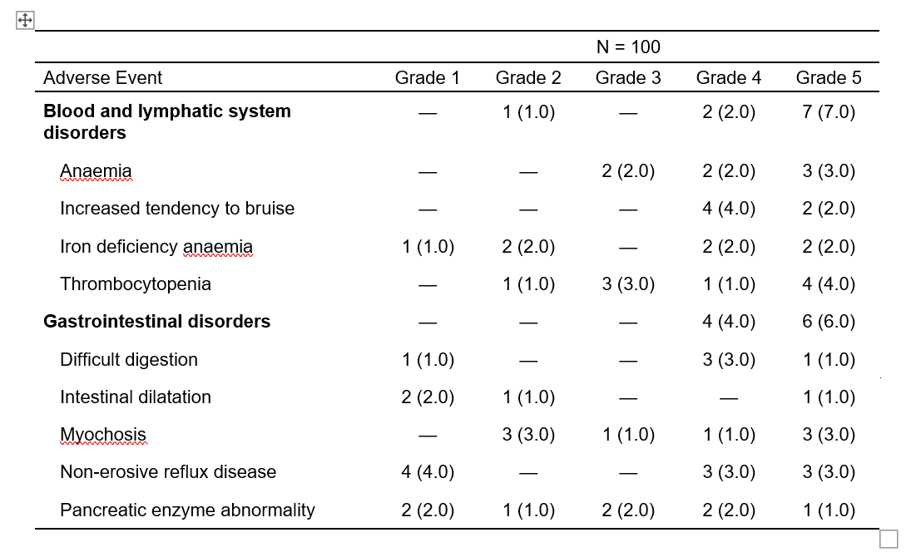

```{r, include = FALSE}
knitr::opts_chunk$set(
  collapse = TRUE,
  comment = "#>"
)
```

# Setup

```{r setup}
# install.packages("gtreg")
library(gtreg)
library(gtsummary)
```

# Overview

As {gtreg} is built upon {gtsummary}, you can use the same methods you
would use for {gtsummary} to output tables to various formats.
A {gtreg} table can be exported with {gt}, {flextable}, {huxtable}, {kableExtra}, `knitr::kable()`, and as a tibble.
See the [print engines available in {gtsummary}](https://www.danieldsjoberg.com/gtsummary/#gtsummary--r-markdown) for details.

Here, we share approaches to common requests and recommendations for each output type.

# Example table

```{r}
table1 <- 
  df_adverse_events %>% 
  tbl_ae(
    id = patient_id,
    id_df = df_patient_characteristics,
    ae = adverse_event,
    soc = system_organ_class, 
    by = grade
  ) %>% 
  modify_header(
    all_ae_cols() ~ "**Grade {by}**"
    ) %>%
  bold_labels()
```

# Example outputs

## HTML

The default output type is HTML.

```{r}
table1
```

## Word

Leverage the [{flextable}](https://ardata-fr.github.io/flextable-book/) package for word output.

```{r, eval=FALSE}
table1 %>%  
  as_flex_table() %>% 
  flextable::save_as_docx(path = "misc/ae_table.docx")
```





## Excel

Leverage the [{huxtable}](https://hughjonesd.github.io/huxtable/) package for excel output.

```{r, eval=FALSE}
table1 %>%  
 as_hux_xlsx(
   file = "misc/ae_table.xlsx"
   )
```


## PDF

Leverage the [{kableExtra}](https://cran.r-project.org/web/packages/kableExtra/vignettes/awesome_table_in_pdf.pdf) package for styled PDF output.

To export to PDF, create a new `.Rmd` or `.qmd` document with a PDF output type.
The YAML shown here is for `.Rmd`.
You can then use `as_kable_extra()` to convert the table to the LaTeX required for pdf rendering, and `kable_styling()` for extra styling of the table.
For more pdf styling options, see the blog post [Report Ready PDF tables with rmarkdown, knitr, kableExtra, and LaTeX](https://www.pipinghotdata.com/posts/2022-01-24-report-ready-pdf-tables-with-rmarkdown-knitr-kableextra-and-latex/).


````{verbatim}
---
output: pdf_document
---
<stuff>  
  
```{r}
table1 %>% 
  as_kable_extra(
    booktabs = TRUE
  ) %>% 
  kableExtra::kable_styling(
    latex_options = "striped",
    stripe_color = "gray!15"
  )
```  
  
````


